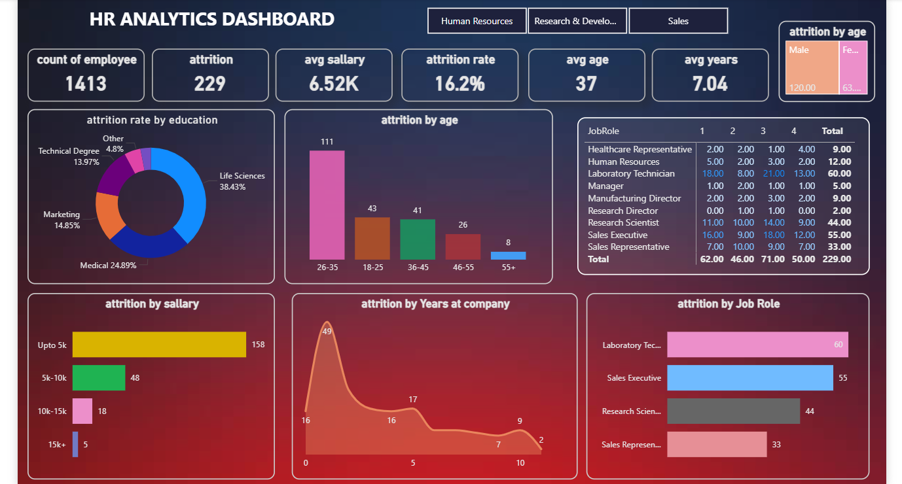

# Sales-data-analysis-powerbi
Power BI dashboard project analyzing sales data to generate business insights and performance trends.

🔹 Project Overview

This project focuses on analyzing sales data using Power BI to identify trends, performance metrics, and business insights.

🔹 Objective

The main objective of this project is to:

Analyze overall sales performance

Identify top-performing products

Track monthly sales trends

Generate interactive dashboards

🔹 Tools Used

Power BI

Excel / CSV Dataset

Data Cleaning Techniques

🔹 Key Steps Performed

Data Cleaning and Transformation

Data Modeling

Creating DAX Measures

Building Interactive Dashboard

Visualizing KPIs and Trends

🔹 Key Insights

Identified highest sales month

Found top-performing products

Compared regional sales performance

Analyzed revenue growth patterns

🔹 Dashboard Preview

🔹 Conclusion
This project demonstrates my ability to clean, analyze, and visualize business data using Power BI.
